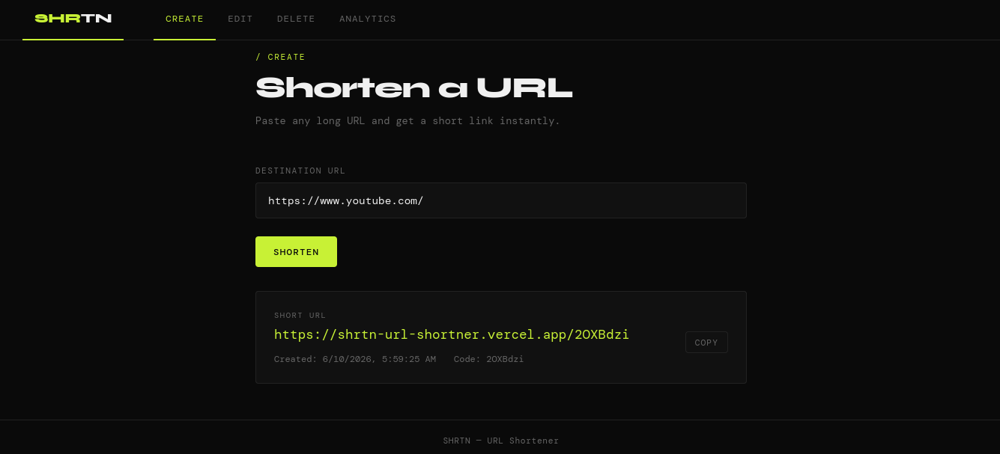
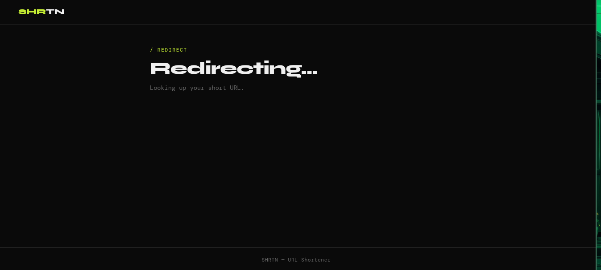
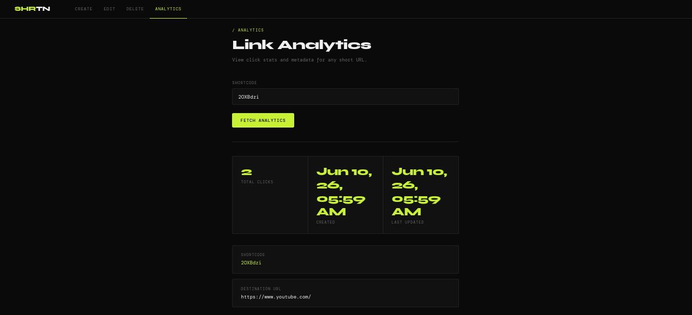

# SHRTN — URL Shortener

> **Live:** [shrtn-url-shortner.vercel.app](https://shrtn-url-shortner.vercel.app)

A full-stack URL shortener built with FastAPI and vanilla HTML/CSS/JS, backed by PostgreSQL. Create short links, track clicks, edit destinations, and delete links — all from a clean, minimal dashboard.

## demonstration

### Create

### redirect


### Analytics


---

## Features

- **Create** — shorten any long URL into a 7-character code
- **Redirect** — visiting a short URL seamlessly redirects to the original destination
- **Edit** — update the destination of any existing short link
- **Delete** — permanently remove a short link
- **Analytics** — view access count, creation date, and last updated time per link
- **404 Handling** — unrecognized short codes show a friendly error page with auto-redirect

---

## Tech Stack

| Layer | Technology |
|---|---|
| Backend | FastAPI, SQLAlchemy 2.x, Pydantic v2 |
| Database | PostgreSQL (Neon) / SQLite (fallback) |
| Frontend | HTML, CSS, Vanilla JS |
| Hosting | Vercel (both frontend and backend) |
| Package Manager | uv |

---

## Project Structure

```
├── backend/
│   ├── app.py                  # FastAPI routes and middleware
│   ├── db.py                   # Database engine, session, Base
│   ├── model.py                # SQLAlchemy ORM model (urlmap)
│   ├── validation_model.py     # Pydantic request/response schemas
│   └── utility.py              # Random shortcode generator
├── frontend/
│   ├── index.html              # Create short URL
│   ├── edit.html               # Edit destination URL
│   ├── delete.html             # Delete a short URL
│   ├── analytics.html          # View link stats
│   ├── 404.html                # Shortcode resolver + redirect handler
│   ├── vercel.json             # Frontend routing rules
│   ├── serve.js                # Local dev server (Node.js)
│   ├── css/style.css           # Shared styles
│   └── js/
│       ├── utils.js            # Shared helpers, API base URL
│       └── config.js           # Environment config (not committed)
├── main.py                     # App entrypoint (Uvicorn / Vercel)
├── vercel.json                 # Backend Vercel config
├── pyproject.toml              # Python dependencies
└── requirements.txt            # Vercel Python runtime dependencies
```

---

## How It Works

### Creating a Short URL

1. User submits a long URL via the frontend
2. Frontend calls `POST /shrtn` on the backend
3. Backend generates a unique 7-character alphanumeric shortcode
4. The mapping is stored in PostgreSQL
5. Frontend displays the short URL as `{FRONTEND_URL}/{shortcode}`

### Redirecting

Vercel has no server-side routing for plain static sites, so redirection is handled client-side:

1. User visits `https://shrtn-url-shortner.vercel.app/1IlkyfU`
2. Vercel's `frontend/vercel.json` rewrites any unknown path to `404.html`
3. `404.html` extracts the shortcode from `window.location.pathname`
4. It calls `GET /shrtn/{shortcode}` on the backend
5. On success, it sets `window.location.href` to the original URL
6. On failure, it shows a not-found message and redirects to the homepage

### Analytics

Each time `GET /shrtn/{shortcode}` is called (i.e. on every redirect), the backend increments `accessCount` on that record. The analytics page calls `GET /shrtn/{shortcode}/stats` which returns the count alongside metadata — this endpoint does **not** increment the counter.

---

## API Reference

Base URL: `https://shrtn-backend.vercel.app`

| Method | Endpoint | Description | Auth |
|---|---|---|---|
| `POST` | `/shrtn` | Create a short URL | — |
| `GET` | `/shrtn/{code}` | Get URL info + increment click count | — |
| `PUT` | `/shrtn/{code}` | Update destination URL | — |
| `DELETE` | `/shrtn/{code}` | Delete a short URL | — |
| `GET` | `/shrtn/{code}/stats` | Get analytics (no click increment) | — |

### Request / Response Examples

**POST `/shrtn`**
```json
// Request
{ "url": "https://example.com/very/long/url" }

// Response 201
{
  "id": 1,
  "url": "https://example.com/very/long/url",
  "shortcode": "1IlkyfU",
  "createdAt": "2025-01-01T12:00:00",
  "updatedAt": "2025-01-01T12:00:00"
}
```

**GET `/shrtn/{code}/stats`**
```json
// Response 200
{
  "id": 1,
  "url": "https://example.com/very/long/url",
  "shortcode": "1IlkyfU",
  "accessCount": 42,
  "createdAt": "2025-01-01T12:00:00",
  "updatedAt": "2025-01-01T12:00:00"
}
```

---

## CORS

CORS is configured in `backend/app.py` using FastAPI's `CORSMiddleware`. In production, `allow_origins` is restricted to the frontend's Vercel domain only:

```python
app.add_middleware(
    CORSMiddleware,
    allow_origins=["https://shrtn-url-shortner.vercel.app"],
    allow_methods=["*"],
    allow_headers=["*"],
)
```

This ensures the API only accepts browser requests originating from the official frontend. Direct requests via curl or Postman still work since CORS is a browser-enforced policy.

---

## Database

The app supports two database modes:

| Mode | Used When |
|---|---|
| PostgreSQL (Neon) | `DATABASE_URL` environment variable is set |
| SQLite (local file) | `DATABASE_URL` is not set (fallback) |

This is handled automatically in `backend/db.py` — no code changes needed between environments. SQLite is ephemeral on Vercel (data resets on redeploy), so PostgreSQL via Neon is required for production persistence.

---

## Running Locally

### Prerequisites

- Python 3.14+
- Node.js
- PostgreSQL (or use the SQLite fallback — no setup needed)
- [uv](https://github.com/astral-sh/uv)

### Backend

```bash
# Install dependencies
uv sync

# Run the backend
python main.py
# API available at http://localhost:8000
```

### Frontend

```bash
cd frontend
node serve.js
# Frontend available at http://localhost:5500
```

### Config

Create `frontend/js/config.js` (not committed to git):

```js
const CONFIG = {
  API: "http://localhost:8000",
  FRONTEND: "http://localhost:5500"
};
```

---

## Deployment

The app is deployed as two separate Vercel projects from the same GitHub repository.

### Backend

- **Root directory:** `/` (project root)
- **Config:** `vercel.json` at project root
- **Environment variables:**
  - `DATABASE_URL` — Neon PostgreSQL connection string

### Frontend

- **Root directory:** `frontend/`
- **Config:** `frontend/vercel.json`
- **No environment variables** — config is handled via `frontend/js/config.js`

After deploying both, update `config.js` with the live URLs and push.

---


Inspired by [roadmap.sh/projects/url-shortening-service](https://roadmap.sh/projects/url-shortening-service)